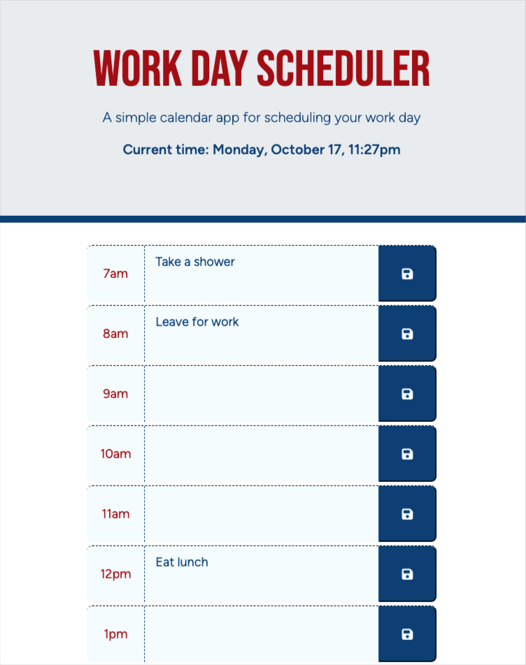

# Work Day Scheduler

## Description

As a busy person, a tool to organize and keep track of the day's events can be very helpful.  This app gives the user the opportunity to make entries on the current day's appointments.  As the day progresses, the entry fields change color based on whether the event is in the past, present or future, conveying a sense of urgency to the day's events.

Building this application presented me an opportunity to develop using jQuery, day.js, Bootstrap, Font Awesome and Google fonts.

## Usage

This app works in the browser and is responsive to devices screen sizes. It utilizes the browser's localStorage to retain appointment entries.  These will persist until removed through the app or if the user clears their browser's localStorage.

Adding an entry is as simple as clicking (or tapping) into the appointment text fields and clicking the save icon. An item may be removed by selecting and deleting the text and again, clicking the save icon.

## Credits

The script code in this project is mostly written by me, but I do give credit to my instructor Kris Renaldi, my tutor Jili Jiang, and my classmate Chris Lemmon for pointing me in the right direction on a couple of conceptual hurdles. I did rely on existing code to use jQuery to correctly set event listeners on the multiple save buttons, and that can be found here:
[https://stackoverflow.com/questions/45563841/get-val-of-element-multiple-forms-at-one-page-with-jquery](https://stackoverflow.com/questions/45563841/get-val-of-element-multiple-forms-at-one-page-with-jquery).

This project did include starter code for the index.html and style.css, though I modified the CSS file heavily.

## MIT License

Copyright (c) 2022 Mike Johnson

Permission is hereby granted, free of charge, to any person obtaining a copy
of this software and associated documentation files (the "Software"), to deal
in the Software without restriction, including without limitation the rights
to use, copy, modify, merge, publish, distribute, sublicense, and/or sell
copies of the Software, and to permit persons to whom the Software is
furnished to do so, subject to the following conditions:

The above copyright notice and this permission notice shall be included in all
copies or substantial portions of the Software.

THE SOFTWARE IS PROVIDED "AS IS", WITHOUT WARRANTY OF ANY KIND, EXPRESS OR
IMPLIED, INCLUDING BUT NOT LIMITED TO THE WARRANTIES OF MERCHANTABILITY,
FITNESS FOR A PARTICULAR PURPOSE AND NONINFRINGEMENT. IN NO EVENT SHALL THE
AUTHORS OR COPYRIGHT HOLDERS BE LIABLE FOR ANY CLAIM, DAMAGES OR OTHER
LIABILITY, WHETHER IN AN ACTION OF CONTRACT, TORT OR OTHERWISE, ARISING FROM,
OUT OF OR IN CONNECTION WITH THE SOFTWARE OR THE USE OR OTHER DEALINGS IN THE
SOFTWARE.

